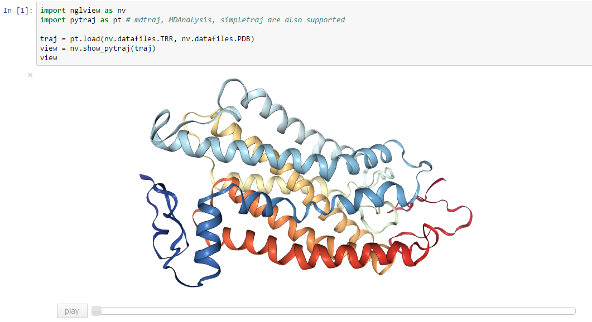

An IPython widget to interactively view molecular structures and trajectories. Utilizes the embeddable [NGL Viewer](https://github.com/arose/ngl) for rendering.

Very much work in progress. Please contact me (arose (Alexander Rose) ) if you want to take part. Should work with Python 2 and 3. If you experience problems, please file an [issue](https://github.com/arose/nglview/issues).

Table of contents
=================

* [Installation](#installation)
* [Usage](#Usage)
* [Interface classes](#Interface classes)
* [Changelog](#changelog)
* [License](#license)

Installation
============

From github:

    git clone https://github.com/hainm/nglview

Changelog
=========

Version 0.4dev
--------------

* ADD: append a "WebGL not supported message" to widget if so
* ADD: `clip` and `fog` widget properties
* ADD: `params` property for `Structure`, dict passed to NGL
* CODE: be less noisy when importing nglview
* DOC: more usage examples, API description
* DOC: added CHANGELOG file

Version 0.3
-----------

* MIGRATION: `Trajectory` classes need `get_frame_count` method
* MIGRATION: removed `set_frame` method use new `frame` property
* ADD: simple trajectory player
* ADD: widget resizing support
* ADD: picking support (gui info; `picked` property)
* CODE: check for file existence in `FileStructure` and `SimpletrajTrajectory`

Version 0.2
-----------

* MIGRATION: changed `get_string` to `get_structure_string`
* MIGRATION: changed `get_coordinates` to `get_coordinates_list`
* DOC: usage, interface classes
* ADD: MDTrajTrajectory adaptor
* CODE: added interface classes
* CODE: suggested packages; mdtraj, simpletraj

Older versions
--------------

For changes in older versions please see the [CHANGELOG](CHANGELOG.md) file.

License
=======

Generally MIT, see the LICENSE file for details.
